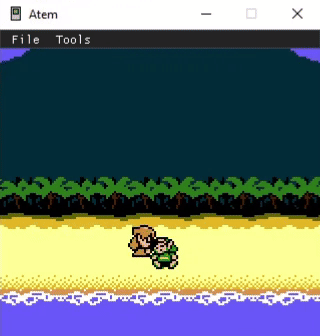
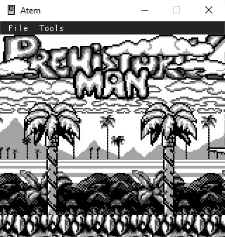

atem [](https://github.com/tyler-m/atem/actions/workflows/ci.yml)
===

A cross-platform emulator for the Game Boy Color written in C#

<a href="images/1.gif"></a> 
<a href="images/2.png"></a>

<a href="images/3.png"></a>

Status
---
- **Processor**
  - Fully implemented Game Boy CPU instruction set
  - Passes Blargg's [cpu_instrs](https://github.com/libretro/testroms/blob/master/blargg-cpu-instrs/) test suite
  
- **Graphics**
  - Per-pixel rendering
  - Passes [cgb-acid2](https://github.com/mattcurrie/cgb-acid2)
  
- **Sound**
  - Synthesizes audio for Pulse, Wave, and Noise channels
  - Audio filters (high-pass, low-pass)
  - Doesn't fully handle "obscure behavior" yet (see [Pan Docs](https://gbdev.io/pandocs/Audio_details.html#obscure-behavior))

- **Memory**
  - Loads MBC1, MBC3, MBC5 cartridges
  - Real-time Clock support for MBC3 cartridges
  
- **Input**
  - Keyboard control rebinding
  - No Gamepad support yet
  - No Serial communication yet (simulated link cable)
  
- **Saving**
  - Save and load emulator states
  - Battery saves (persistent game saves)
  
- **Debugging**
  - Memory view
  - CPU register view
  - Address-based breakpoints

Developing
---

- SDK for .NET 8.0+ must be installed

```
git clone https://github.com/tyler-m/atem.git
cd atem
```

Restore dependencies

`dotnet restore`

Build

`dotnet build`

Test

`dotnet test`

Building for Release
---

- SDK for .NET 8.0+ must be installed

In a Linux terminal or on Windows with Git Bash:

```
git clone https://github.com/tyler-m/atem.git
cd atem
```

Run `./build.sh`

Resulting binaries can be found in `/dist`

Notes
---
This project is made possible by the extensive technical documentation of the Game Boy maintained publicly by retro hardware enthusiasts, most notably, the [Pan Docs](https://github.com/gbdev/pandocs).